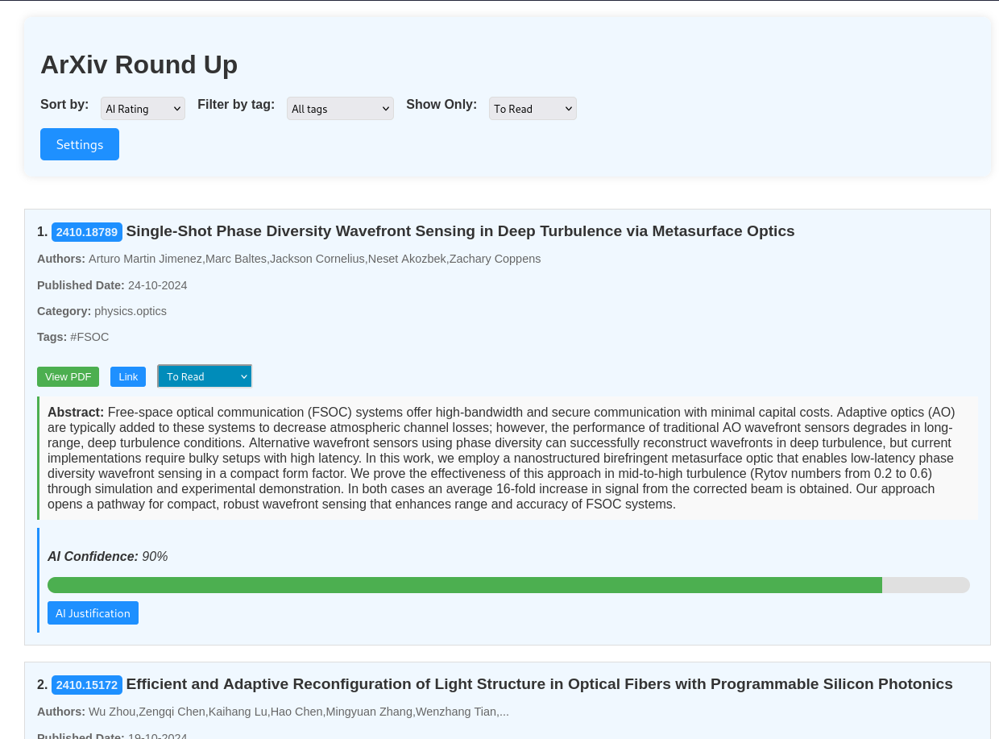

# How to use

For now, the application is primarily run through the command line. The application has the following functions:

    - **Search**: Searches and saves all articels on the ArXiv which matches the given keywords 

    - **Fetch**:  Saves a single article by ArXiv ID

    - **Rank**:   Uses a LLM (either remotely or locally), to rank the saved articles by relevance

    - **Show**:   Shows the articles in a WebUI interface


# Functions

## Search Articles

```
python ./main.py -s -c <config name> -lb <number of days to seach>
```

**Example**:

```
python ./main.py -s -c mhd -lb 14
```

This grabs all the articles from the past 14 days which match the keywords within the `mhd` config.

## Fetch Articles

The *fetch* function, grabs a single article given a ArXiv ID. This takes the arguments for *fetch* `-f` and *id* `-i`. 

```
python ./main.py -f -i <ArXivID>
```

**Example**:

```
python ./main.py -f -i 2310.17036
```

## Rank Articles

```
python ./main.py -r
```

## Display Articles 

While you can browse the generated markdown files in your favourite markdown editor. E.g. Obsidian. You can also browse them in our web app.

```
python ./main -w
```



See an example output [here](./ArXivRoundUpExample.html). (**Note**: the filter, sort, show and settings functionality won't work on the online example.)

## Do it all!
You can combine the flags search, rank and open the webApp all in one go. 

```
python ./main -s -r -w -c <configname> -lb <lookback days> -sk
```

The `-sk` flag will run the entire program without prompting you for further input. It defaults to **not** modifying any entries on disk in the case of a duplicate. 

**Example**

```
python ./main -s -r -w -c FSOC -lb 14 -sk
```


# Reccomendations:

## Setting Up Keyword Configs
See [Config Instructions](searchConfig.md) for instructions on how to setup the keyword matching algorithm. The question is, how coarse should your filter be? 

To a certain degree this is a matter of preference, however the ranking algorithm lets use a coarser filter. Therefore, I reccomend using very coarse filter and then let the ranking algorithm handle the rest. 

### Example

Lets say you are a researcher on trapped ion quantum computing. You *could* create a very specific filter, containing `trapped AND ion AND quantum AND computing.` This might inadvetatnly miss some paper which doesnt match EVERY single term. Instead, a simple filter with `(quantum AND computing) OR qubit OR (trapped AND ion)` this will return many more results. Ordinarily, this would be more difficult to parse, however, using this coarse filter and a LLM ranking we can ensure we capture all the articles, and raise the most relevant ones to the top. 

## How I use it

I have setup a cron-job to run the following commands once a day before I log on. 

```
main.py -s -sk FSOC -lb 7
main.py -s -sk QuantumOptics -lb 7
main.py -r -sk
```

Then it is ready for me to open the webapp as I drink my morning coffee. 